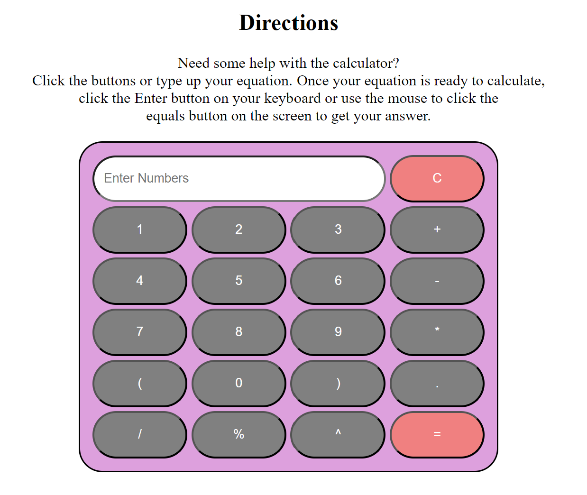
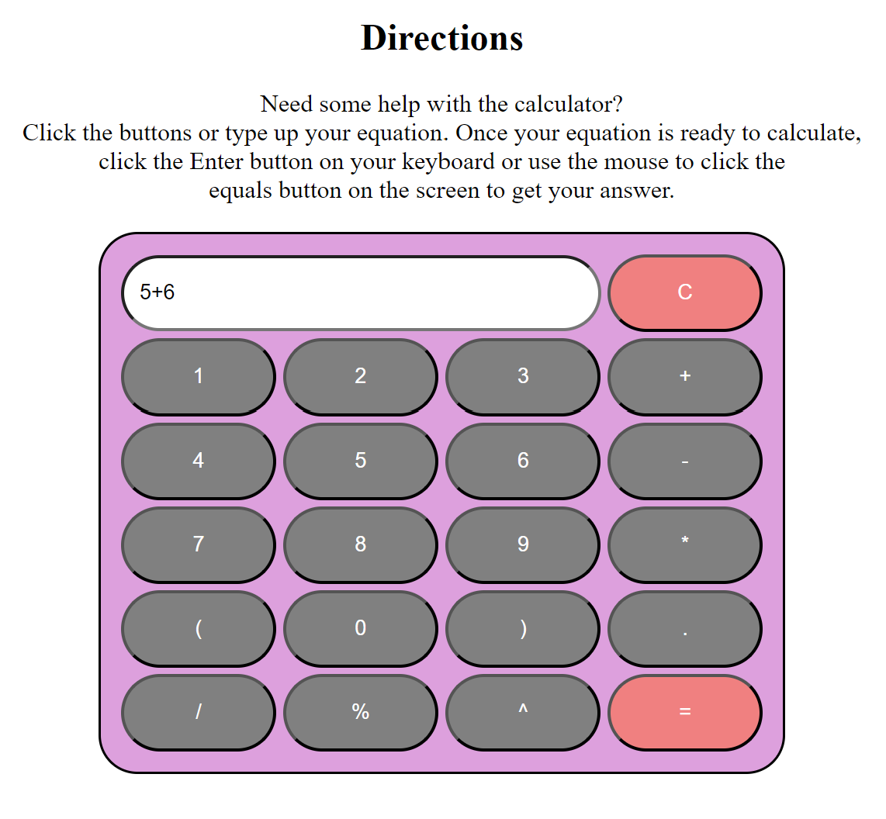

# JavaScript_Calculator
 This is a simple JavaScript Calculator. There are two versions.

 ## Features
* Users can click the buttons on the screen to create equations
* Users can enter numbers and the symbols from the keyboard to create equations
* Once an equation is ready, the user can either click the equal button on the screen or press enter from the keyboard to get the answer to their problems
 
 ## Quick Explanation
 * This version directly appends the key pressed by the user to the "result" field
 * The displayValues function takes a value and appends it to the "result" field
 * The solve function evaluates the expression in the "result" field and updates it with the result
 * The clear function clears the "result" field

## Code Examples
### Controller.js

```
if(input === "=" || e.keyCode === 13) {
            let userinput = document.getElementById("result").value;
            let solution = this.calculator.solve(userinput);
            this.displaySolution(solution);
            this.saveCalculation(userinput, solution);
        } else if (Calculator.ALLOWED_KEYS.includes(input)) {
            this.displayInput(input);
        }
```

The code above executes if the input is an equal sign, or the Enter key is pressed (keyCode 13). It gets the user input from an element with the id "result", calculates the solution using ```this.calculator.solve(userinput)``` method, displays the solution, and saves the calculation.


The code below is a React component named ```CalculatorComponent```. This component renders a calculator interface in HTML: 
```
const CalculatorComponent = function(props) {
    return (
        <div id="calculator">

            <table id="calc">
                <tbody>
                    <tr>
                        <td colspan="3">
                            <input type="text" id="result" placeholder="Enter Numbers" />
                        </td>
                        <td>
                            <input id="clear" type="button" value="C" onclick={() => window.controller.clear()} />
                        </td>
                    </tr>
                    <ButtonGroup keys="1,2,3,+" />
                    <ButtonGroup keys="4,5,6,-" />
                    <ButtonGroup keys="7,8,9,*" />
                    <ButtonGroup keys="(,0,),." />
                    <ButtonGroup keys="/,%,^,=" />
                </tbody>
            </table>

        </div>
    );
};
```

### calculator.js

```
solve(x) {
   this.notifyObservers('calculation', {userinput: x, solution: result});
   return math.evalutate
}
```

The method above performs calculations and notifies the observers of the result.

While the method below clears the value of an HTML element with the id "result". It's used to clear the calculator's display/input field.

```
clear() {
   document.getElementById("result").value="";
}
```

## Photos


